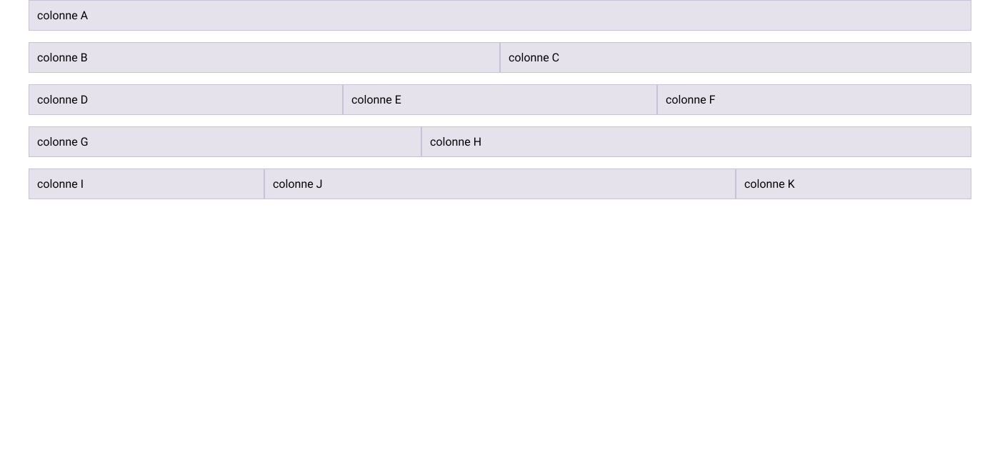

# Exercice Bootstrap 1

## Installation

1. Cloner le repository
2. Ouvrir le dossier avec Visual Studio Code
3. Ouvrir une fenêtre de terminal dans Visual Studio Code et entrer la commande suivante :

```bash
npm install
```

3. Installer Bootstrap avec la commande suivante :

```bash
npm install bootstrap
```

4. Dans _main.scss_, inclure la CSS de la grille Bootstrap :

```scss
@import "bootstrap/scss/bootstrap-grid";
```

5. Pour rendre la grille visible, ajouter la CSS suivante dans _main.scss_

```css
.row + .row {
  margin-top: 16px;
}

.row > .col,
.row > [class^="col-"] {
  padding-top: 12px;
  padding-bottom: 12px;
  background-color: rgba(86, 61, 124, 0.15);
  border: 1px solid rgba(86, 61, 124, 0.2);
}
```

## Travail

Depuis le terminal, entrer la commande suivante :

```bash
npm run dev
```

## Consigne

Intégrez [la maquette Figma](https://www.figma.com/design/AYSTUluL0uivJXH4LS730U/imd2-exercice-bootstrap-1?node-id=0-1&t=Vr56IhixpL0y6m54-1) en utilisant la grille Bootstrap.

☝️ Vous n'avez pas besoin de modifier la CSS. Ajoutez uniquement du HTML.

☝️ Pensez à afficher la grille sur Figma, afin de voir la largeur des colonnes.

## Aperçu


